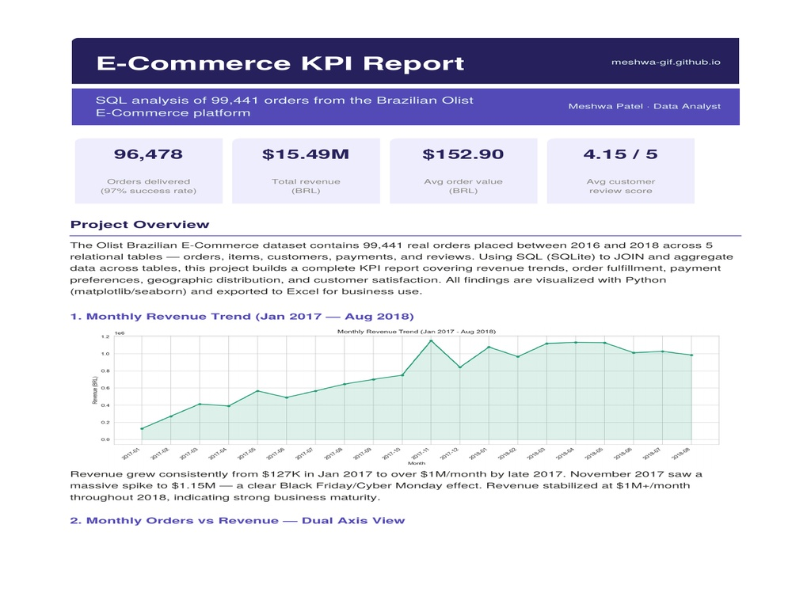
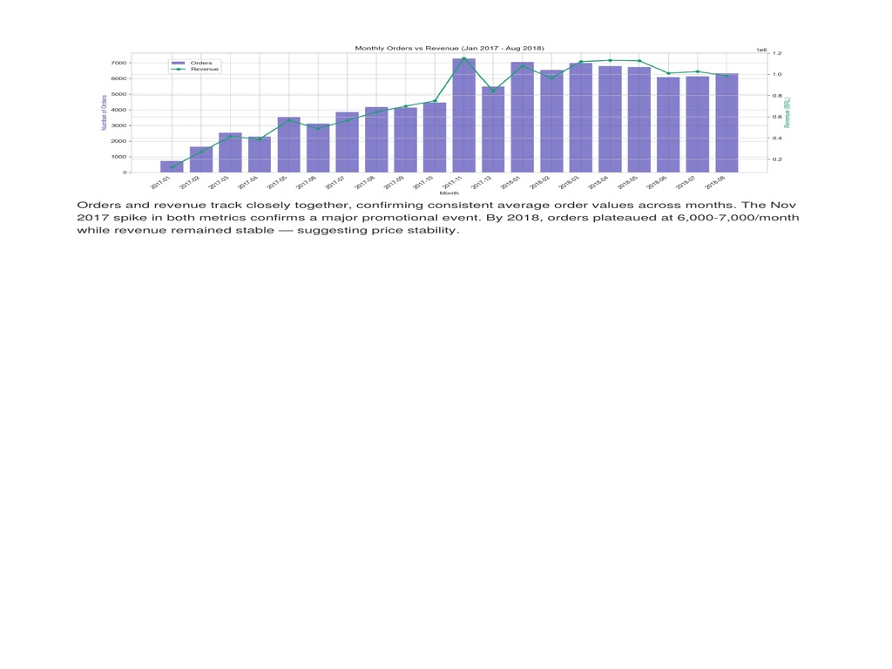
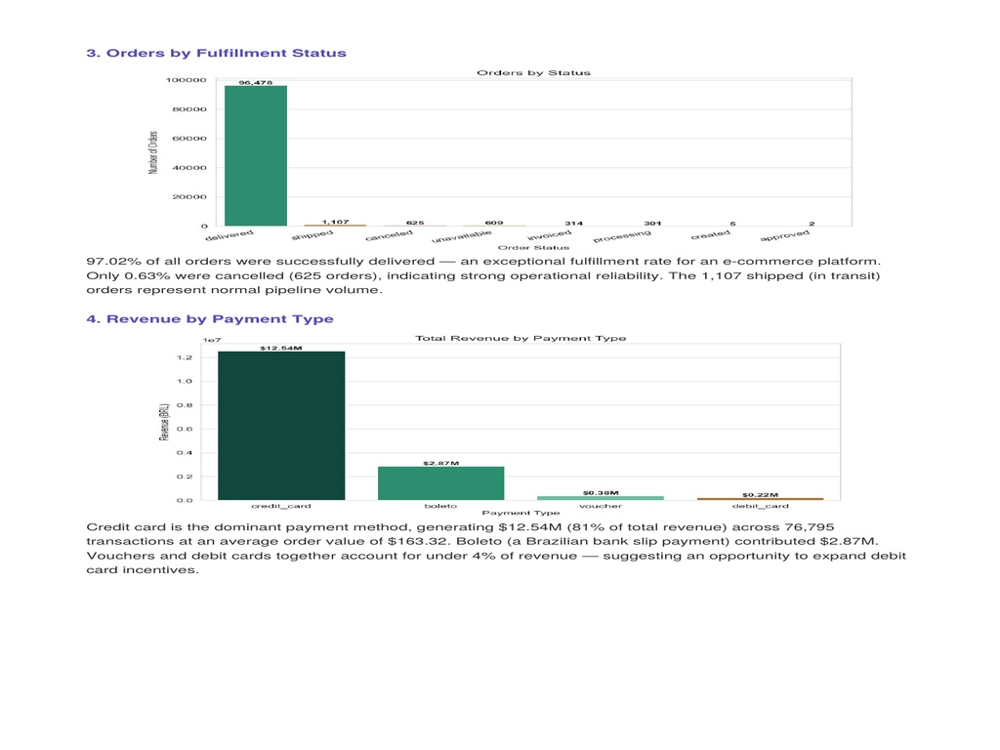
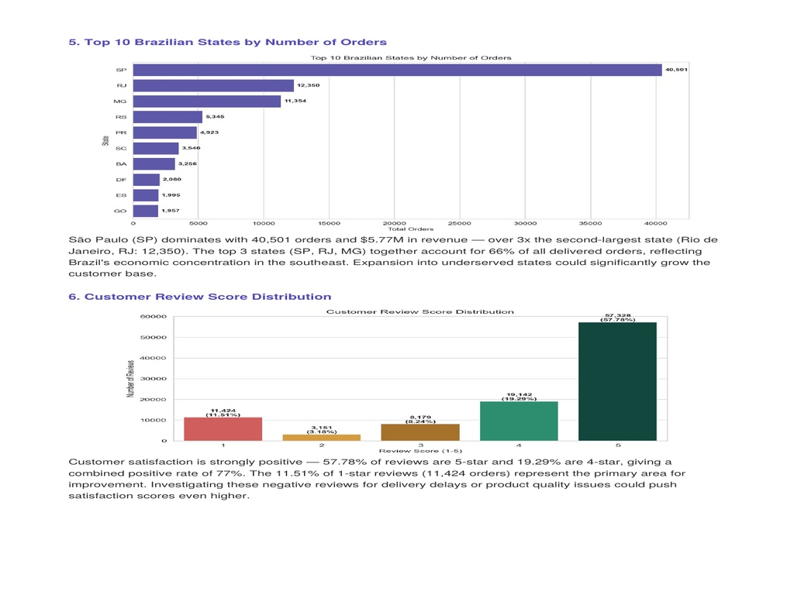
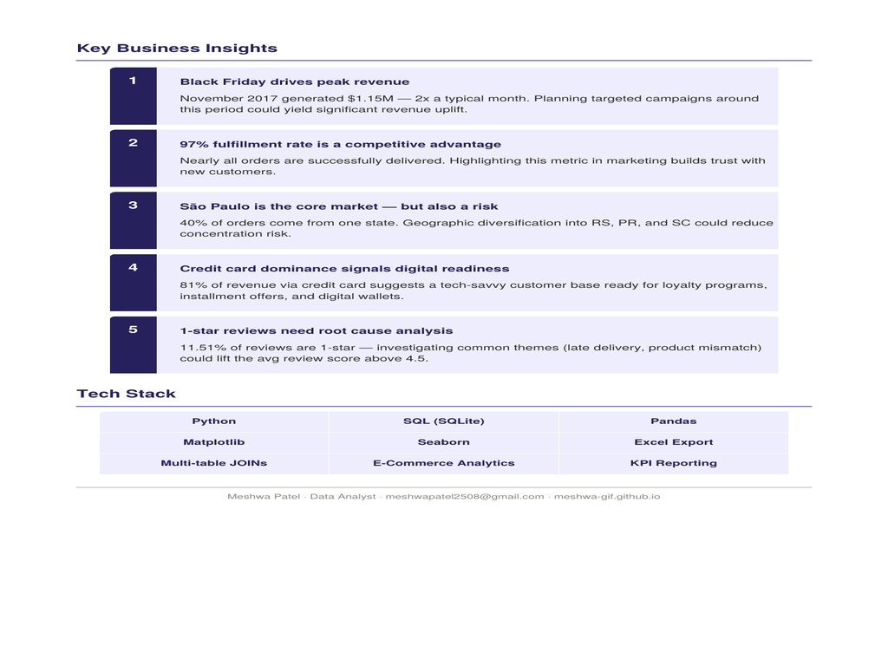

# E-Commerce KPI Report — SQL + Python (Olist)


End-to-end e-commerce KPI analysis on **99,441 real orders** from the Brazilian Olist marketplace platform (2016–2018). SQL JOINs across 5 relational tables to build a unified analytical dataset — covering revenue trends, order fulfillment, payment preferences, geographic distribution, and customer satisfaction.

---

## Project Preview



---

## Key Results

| Metric | Value |
|--------|-------|
| Total Orders | **99,441** |
| Orders Delivered | **96,478 (97.02%)** |
| Total Revenue | **$15.49M (BRL)** |
| Avg Order Value | **$152.90 (BRL)** |
| Avg Customer Review Score | **4.15 / 5** |
| Peak Monthly Revenue | **$1.15M** (Nov 2017 — Black Friday) |
| Top State | São Paulo — 40,501 orders, $5.77M revenue |
| 5-Star Reviews | **57.78%** of all reviews |

---

## 6 Analyses Performed

### 1. Monthly Revenue Trend (Jan 2017 — Aug 2018)


Revenue grew consistently from **$127K in Jan 2017 to over $1M/month** by late 2017. November 2017 saw a massive spike to **$1.15M** — a clear Black Friday/Cyber Monday effect. Revenue stabilized at $1M+/month throughout 2018, indicating strong business maturity.

---

### 2. Monthly Orders vs Revenue — Dual Axis View


Orders and revenue track closely together, confirming consistent average order values across months. The Nov 2017 spike in both metrics confirms a major promotional event. By 2018, orders plateaued at **6,000–7,000/month** while revenue remained stable — suggesting price stability.

---

### 3. Orders by Fulfillment Status


| Status | Count |
|--------|-------|
| Delivered | **96,478 (97.02%)** |
| Shipped (in transit) | 1,107 |
| Cancelled | 625 (0.63%) |
| Unavailable | 609 |
| Invoiced | 314 |
| Processing | 301 |

97.02% of all orders were successfully delivered — an exceptional fulfillment rate for an e-commerce platform. Only 0.63% were cancelled (625 orders), indicating strong operational reliability.

---

### 4. Revenue by Payment Type

| Payment Method | Revenue | Share |
|----------------|---------|-------|
| Credit card | **$12.54M** | **81%** |
| Boleto (bank slip) | $2.87M | 18.5% |
| Voucher | $0.38M | 2.5% |
| Debit card | $0.22M | 1.4% |

Credit card is the dominant payment method at **$12.54M (81% of total revenue)** across 76,795 transactions at an average order value of $163.32. Vouchers and debit cards together account for under 4% — suggesting an opportunity to expand debit card incentives.

---

### 5. Top 10 Brazilian States by Number of Orders


| State | Orders | Notes |
|-------|--------|-------|
| São Paulo (SP) | **40,501** | $5.77M revenue — 40% of all orders |
| Rio de Janeiro (RJ) | 12,350 | 2nd largest |
| Minas Gerais (MG) | 11,354 | 3rd largest |
| Rio Grande do Sul (RS) | 5,345 | |
| Paraná (PR) | 4,923 | |

São Paulo dominates with 40,501 orders — over **3x** the second-largest state. The top 3 states (SP, RJ, MG) together account for **66% of all delivered orders**, reflecting Brazil's economic concentration in the southeast. Expansion into underserved states could significantly grow the customer base.

---

### 6. Customer Review Score Distribution

| Score | Count | Share |
|-------|-------|-------|
| 5 ⭐ | 57,328 | **57.78%** |
| 4 ⭐ | 19,142 | 19.29% |
| 3 ⭐ | 8,179 | 8.24% |
| 2 ⭐ | 3,151 | 3.18% |
| 1 ⭐ | 11,424 | 11.51% |

Customer satisfaction is strongly positive — **57.78% of reviews are 5-star** and 19.29% are 4-star, giving a combined positive rate of 77%. The 11.51% of 1-star reviews represent the primary area for improvement.

---

## Key Business Insights


**1. Black Friday drives peak revenue**
November 2017 generated $1.15M — 2x a typical month. Planning targeted campaigns around this period could yield significant revenue uplift.

**2. 97% fulfillment rate is a competitive advantage**
Nearly all orders are successfully delivered. Highlighting this metric in marketing builds trust with new customers.

**3. São Paulo is the core market — but also a risk**
40% of orders come from one state. Geographic diversification into RS, PR, and SC could reduce concentration risk.

**4. Credit card dominance signals digital readiness**
81% of revenue via credit card suggests a tech-savvy customer base ready for loyalty programs, installment offers, and digital wallets.

**5. 1-star reviews need root cause analysis**
11.51% of reviews are 1-star — investigating common themes (late delivery, product mismatch) could lift the avg review score above 4.5.

---

## SQL Highlights

```sql
-- Revenue by state with order count
SELECT c.customer_state,
       COUNT(o.order_id)        AS total_orders,
       SUM(p.payment_value)     AS total_revenue,
       AVG(r.review_score)      AS avg_review_score
FROM orders o
JOIN customers c        ON o.customer_id  = c.customer_id
JOIN order_payments p   ON o.order_id     = p.order_id
JOIN order_reviews r    ON o.order_id     = r.order_id
GROUP BY c.customer_state
ORDER BY total_revenue DESC;

-- Monthly revenue trend
SELECT strftime('%Y-%m', o.order_purchase_timestamp) AS month,
       COUNT(o.order_id)                              AS total_orders,
       SUM(p.payment_value)                           AS monthly_revenue
FROM orders o
JOIN order_payments p ON o.order_id = p.order_id
WHERE o.order_status = 'delivered'
GROUP BY month
ORDER BY month;

-- Payment type breakdown
SELECT p.payment_type,
       COUNT(*)              AS transactions,
       SUM(p.payment_value)  AS total_revenue,
       AVG(p.payment_value)  AS avg_order_value
FROM order_payments p
GROUP BY p.payment_type
ORDER BY total_revenue DESC;
```

---

## Tech Stack

`Python` `SQL (SQLite)` `Pandas` `Matplotlib` `Seaborn` `Excel Export` `Multi-table JOINs` `E-Commerce Analytics` `KPI Reporting`

---

## Dataset

- **Source:** Brazilian E-Commerce Public Dataset by Olist
- **Records:** 99,441 orders (2016–2018)
- **Tables joined:** orders, customers, order_items, order_payments, order_reviews
- **Download:** [Kaggle — Olist Brazilian E-Commerce](https://www.kaggle.com/datasets/olistbr/brazilian-ecommerce)

---

## Project Context

Built as part of my data analytics portfolio to demonstrate:
- SQL JOINs across 5 relational tables to build a unified analytical dataset
- End-to-end KPI reporting pipeline from raw transactional data
- Revenue trend analysis with seasonal pattern detection
- Geographic distribution analysis and market concentration insights
- Customer satisfaction analysis with actionable improvement recommendations
- Python data visualization with Matplotlib and Seaborn for stakeholder reporting

---

## Author

**Meshwa Patel** — Data Analyst
[Portfolio](https://meshwa-gif.github.io) · [LinkedIn](https://www.linkedin.com/in/meshwapatel-2b24a8385) · [Email](mailto:meshwapatel2508@gmail.com)
